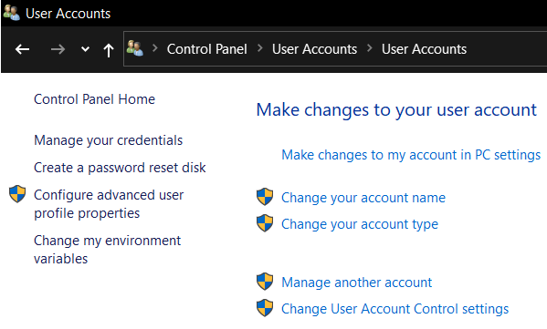
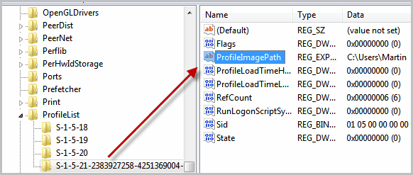

# Change-User-Profile
Change user profile folder name ( When you give your laptop to another person )

### Check Accounts 

Steps :

1. `Delete` all the apps & clear the folders in the users account corresponding folder.

2. Open `Command Prompt` in `Admin` 

```cmd
net user
```

3. `Activate` Administrator account.

```cmd
net user administrator /active:yes
```

4. `Sign out` from existing account & `Sign` in through Administrator account.

5. `Rename` the user account name ( Manage User Account )



6. `Edit` the registry

`Open` the Windows Registry Editor with the shortcut `Windows` + `R`, then `regedit`

`Navigate` to the following Registry key:

`HKEY_LOCAL_MACHINE\SOFTWARE\Microsoft\Windows NT\CurrentVersion\ProfileList`

Edit `ProfileImagePath` folder with the data set to the profile path of the old username, e.g. `c:\Users\OldName`



7. `Deactivate` Administrator account.

```cmd
net user administrator /active:no
```

8. `Sign Out` from Administrator account and `Sign In` with new account.
